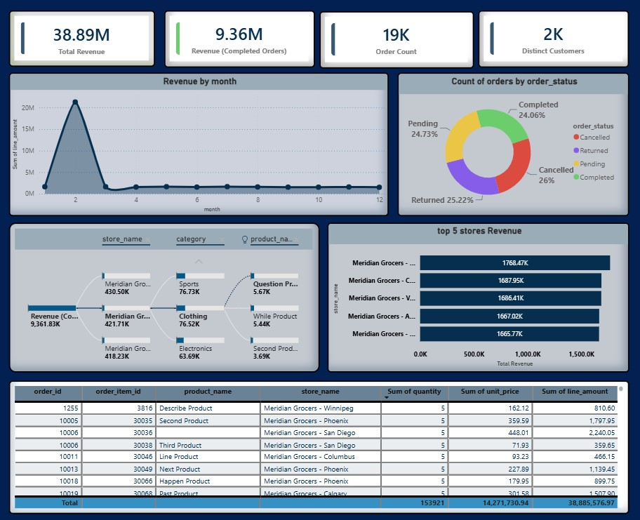
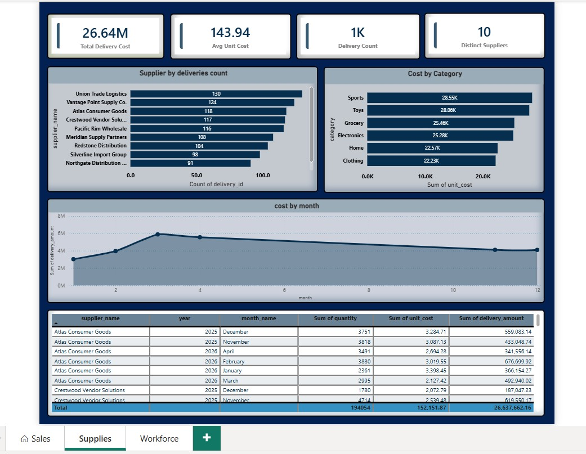
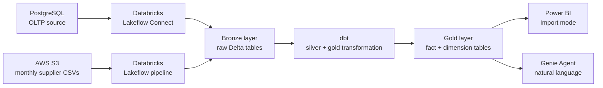

# Business layer

This file is for anyone who wants to understand what the pipeline actually delivers, without reading about dbt models or Airflow DAGs. If you are a data engineer and want the technical depth, start with [`dbt/README.md`](dbt/README.md).

The pipeline produces two consumption surfaces: a three-page Power BI report for structured analysis, and a Databricks Genie Agent for questions the fixed report pages don't cover.

**Live report:** [retail-report.com]

---

## What business questions this answers

**Sales**
- How is revenue trending month over month?
- What share of orders are completed, pending, cancelled, or returned?
- Which stores and product categories drive the most revenue?
- What does the order breakdown look like at the line-item level?

**Supplies (Procurement)**
- What is the total procurement cost and how does it move by month?
- Which suppliers deliver the most volume and at what unit cost?
- Which product categories carry the highest acquisition cost?

**Workforce**
- How many active employees does the business have and how are they distributed across stores?

---

## How to access the report

**Power BI report:** The live published report is at [retail-report.com]. No login required to view.

**Genie Agent:** The agent runs inside Databricks. Access requires a Databricks workspace login. A screenshot of a live query is in the [Genie Agent](#genie-agent) section below.

---

## Report pages

### Sales

**What it answers:** Revenue performance across time, stores, and product categories, with a full order status breakdown.

**Key numbers on this page:**

- Total revenue: 18.95M
- Revenue from completed orders only: 4.65M
- Total order count: 10K
- Distinct customers: 2K

**What to look at:**

The order status donut shows a roughly even four-way split: completed (24.47%), pending (24.36%), cancelled (25.87%), returned (25.3%). More than half of gross revenue never converts to a completed order. That is not a data quality issue, it is what the source data contains, and the report separates completed revenue from total revenue as a KPI so the distinction is always visible.

The decomposition tree lets you drill from store to category to product. The top 5 stores bar chart shows Meridian Grocers locations accounting for the highest revenue concentration across all five positions.

The detail table at the bottom shows order line level data: `order_id`, `order_item_id`, product, store, quantity, unit price, and line amount.

**What this page cannot answer:**

- Which employee handled a given order. The source system does not record an employee-to-order relationship. Workforce analysis is on the Workforce page at the store level only.
- Profit margin. The Sales page has revenue. It does not have cost of goods sold. Procurement cost lives on the Supplies page and there is no lot-level traceability linking a specific delivery to the units later sold.

---

### Supplies

**What it answers:** Procurement volume and cost across suppliers, product categories, and time.

**Key numbers on this page:**

- Total delivery cost: 26.64M
- Average unit cost: 143.94
- Delivery count: 1K
- Distinct suppliers: 10

**What to look at:**

The supplier delivery count bar shows Union Trade Logistics leading at 130 deliveries, with the remaining nine suppliers clustered between 91 and 124. Volume is distributed, not concentrated in a single supplier.

Cost by category shows Sports and Toys carrying the highest unit cost concentration. The cost by month line chart shows a peak around month 4 and a gradual decline through the second half of the year.

The detail table shows each supplier's delivery volume, unit cost, and delivery amount broken down by year and month, giving a full procurement history at the supplier-month grain.

**What this page cannot answer:**

- Gross margin per product. Delivery cost and sales revenue are in separate fact tables with no shared lot or batch identifier. Margin is a proximity-based approximation if derived across both pages, not an exact calculation. This is stated explicitly rather than hidden behind a misleading combined metric.

---

### Workforce

**What it answers:** Active headcount and how employees are distributed across store locations.

**What was deliberately cut and why:**

Two metrics were designed, built, and then removed before the report was published.

Historical headcount trend was cut because `dim_employees` has no real version history. Every SCD2 snapshot check returned exactly one row per employee with no superseded versions, meaning the snapshot captures a single point in time, not a timeline. A trend line built on that data would be flat and misleading.

Average employee tenure was cut because no hire date field exists in the source data. The snapshot's `dbt_valid_from` column reflects when the pipeline first observed the record, not when the employee started. Using it as a tenure proxy would produce numbers that look precise but measure the wrong thing.

What remains on this page is accurate. What was cut is documented here rather than quietly omitted.

---

## How the data gets here

The pipeline ingests from two sources: a PostgreSQL database (orders, customers, products, stores, employees) and an AWS S3 bucket (monthly supplier delivery files). Both land in a bronze layer in Databricks, dbt transforms them through silver into a gold layer of fact and dimension tables, and Power BI and Genie read from gold.

**Why Import mode and not a live connection:**

Power BI was first connected to Databricks via Partner Connect in DirectQuery mode, which sends a query to Databricks on every visual interaction. Response time was slow enough to make the report uncomfortable to use. Switching to Import mode loads a snapshot of the gold tables into Power BI's in-memory engine at refresh time. Every visual interaction after that runs against local memory, not a remote warehouse. The tradeoff is that the report reflects the data as of the last refresh, not the current moment. For a pipeline that runs on a batch schedule, that tradeoff is acceptable. When fresh data is needed, one click on the refresh button in Power BI loads the latest gold layer state.

---

## Genie Agent

The Genie Agent is a Databricks natural language interface connected to the full gold layer. It lets anyone ask questions about the data in plain English and get back answers with charts, without writing SQL or opening the Power BI report.

**Example query from the screenshot:**

> "What is the number of active employees and their distribution across stores?"

Genie returned: 231 active employees across 25 stores, ranging from 3 to 17 employees per store, with an auto-generated bar chart showing the distribution by store.

**How it was set up:**

Connecting Genie to the gold layer required more than pointing it at the tables. Every gold table and every column was given a plain-language description inside Databricks Unity Catalog before the agent was configured. Without those descriptions, Genie cannot reliably map a natural language question to the right table and column. Adding the descriptions first is what makes the agent's answers trustworthy rather than plausible-sounding guesses.

The agent is configured to see the full gold layer: both fact tables, all dimensions, and `dim_products_current`. It returns answers as text and as charts depending on what the question calls for.

**What the report covers that Genie does not:**

The three report pages are curated, pre-built, and consistent. The same metrics appear in the same place every time. Genie is flexible but not curated. It is the right tool for a question that falls outside the fixed report pages, not a replacement for them.

---

## What this data cannot answer

These are not gaps to be filled later. They are structural boundaries from the source system, stated here so no one builds a decision on a metric that looks correct but isn't.

- **Employee-to-order attribution.** The source system does not record which employee handled which order. There is no `employee_id` on the orders table. Any metric that tries to connect individual employees to revenue is fabricated from the available data.
- **Exact gross margin.** No traceability links a specific supplier delivery to the units later sold as orders. A margin calculation that divides procurement cost by sales revenue is an approximation across two independent business processes, not an exact figure.
- **Real order date.** The `created_at` timestamp is used as the order date throughout. If any orders have a gap between when the customer placed the order and when the system created the record, time-based analysis inherits that lag with no way to detect it.
- **Real-time data.** The report is an import snapshot. It reflects the state of the gold layer at the time of the last scheduled pipeline run and Power BI refresh. It does not update continuously.
