# Retail Lakehouse Pipeline


End-to-end retail data engineering pipeline. PostgreSQL OLTP source feeds a Databricks medallion lakehouse through two independent ingestion paths, dbt handles all transformation and testing, Airflow orchestrates the full chain in Docker, and a consumption layer serves both structured reporting and ad-hoc natural language queries.

**Status: complete.** 123/123 dbt tests passing. Both fact tables verified on grain. Three-page Power BI report published. Genie Agent live against the gold layer. Airflow pushes failure alerts to Gmail and Telegram.

For the engineering reasoning behind each subsystem:

- [`BUSINESS_LAYER.md`](BUSINESS_LAYER.md): what the pipeline delivers, the three report pages, the Genie Agent, what the data cannot answer
- [`postgres/README.md`](postgres/README.md): PostgreSQL source provisioning on Ghost.build
- [`dbt/README.md`](dbt/README.md): transformation layer, SCD2 design, the fan-out bug, galaxy schema gold layer
- [`airflow/README.md`](airflow/README.md): orchestration, parallel DAG, failure alerting, credential handling
- [`s3/README.md`](s3/README.md): secondary ingestion path, why it runs outside Airflow, how Airflow verifies it

This file stays high level. The subsystem READMEs carry the depth.

---

## Table of contents

- [Why this project exists](#why-this-project-exists)
- [Architecture](#architecture)
- [Tech stack](#tech-stack)
- [How to run this](#how-to-run-this)
- [Pipeline proof](#pipeline-proof)
- [Ingestion pattern: not CDC](#ingestion-pattern-not-cdc)
- [Engineering decisions](#engineering-decisions)
- [Repo structure](#repo-structure)
- [Current build state](#current-build-state)
- [Known limitations](#known-limitations)
- [What I would change with more time](#what-i-would-change-with-more-time)

---

## Why this project exists

I built this to close a real gap in my own skill set: dbt, specifically incremental models, snapshots, and metadata-driven transformation, was new to me going in. Docker and Airflow were not new in theory, I already had a strong foundation in both, but I'd never built and run them end to end in an actual project before this one. Databricks/Spark fundamentals I already had from prior hands-on work, so time here is weighted toward dbt and toward turning Docker/Airflow knowledge I already held into something I've actually shipped.

---

## Architecture

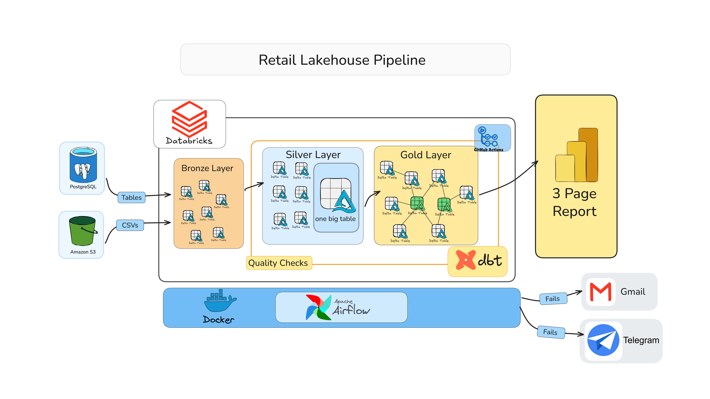

Two source systems feed two independent bronze ingestion paths into Databricks. dbt transforms bronze through a silver technical layer and a silver business layer into a gold galaxy schema. Two business processes, Sales and Supplies, share conformed dimensions (`dim_date`, `dim_product`) while each owns its fact table at its own grain.

On top of gold sits a dual consumption layer. A three-page Power BI report (Sales, Supplies, Workforce) covers recurring structured analysis. A Databricks Genie Agent answers ad-hoc natural language questions against the same gold tables for everything outside the fixed report pages.

Airflow, running in Docker, orchestrates the full chain and routes task failure alerts to both Gmail and Telegram.

---

## Tech stack

| Tool | Role | Why |
|---|---|---|
| PostgreSQL (Ghost.build) | OLTP source | Six-table retail schema: customers, stores, products, employees, orders, order\_items. |
| Databricks Lakeflow Connect | Primary bronze ingestion | Query-based connector, cursor column plus primary key upsert per table. Not CDC. See [Ingestion pattern](#ingestion-pattern-not-cdc). |
| AWS S3 + Lakeflow managed pipeline | Secondary bronze ingestion | Monthly supplier delivery CSVs. Managed Lakeflow pipeline handles file detection and bronze merge, no custom code. |
| dbt Core + dbt-databricks | Silver and gold transformation | Incremental models, SCD2 snapshots, metadata-driven OBT, galaxy schema. |
| Apache Airflow (Docker) | Orchestration | Sequences Databricks jobs and dbt runs. No transformation logic inside a DAG task. |
| Databricks Genie Agent | Ad-hoc consumption | Natural language interface over the gold layer for questions the fixed report doesn't cover. |
| Power BI Desktop | Structured consumption | Three-page report (Sales, Supplies, Workforce). Import mode via Databricks Partner Connect. |
| Gmail + Telegram (Airflow) | Failure alerting | Task-level `on_failure_callback` pushes to two independent channels. One channel going down doesn't silence the failure. |
| GitHub Actions | CI gate | Runs the full dbt test suite on every push, blocks merge on failure. |

---

## How to run this

Four stages in fixed order. Each stage's detailed setup lives in its own README.

**Prerequisites:** Python 3.12+, [`uv`](https://docs.astral.sh/uv/), a Databricks workspace, a PostgreSQL-compatible database on [Ghost.build](https://ghost.build), Docker.

### 1. Provision the source database

Full steps: [`postgres/README.md`](postgres/README.md)

```bash
cd postgres
uv venv && source .venv/bin/activate
uv sync
cp .env.example .env
python setup_db.py
python load_data.py
```

### 2. Connect Databricks to both sources

**Primary path:** Configure a Lakeflow Connect query-based connector targeting your PostgreSQL instance. One connector per source table, cursor column plus primary key per table.

**Secondary path:** Configure a managed Lakeflow ingestion pipeline in the Databricks Jobs and Pipelines UI targeting your S3 bucket. Full steps: [`s3/README.md`](s3/README.md)

### 3. Build the transformation layer

Full steps: [`dbt/README.md`](dbt/README.md)

```bash
cd dbt
dbt deps --project-dir . --profiles-dir .
dbt run --project-dir . --profiles-dir .
dbt test --project-dir . --profiles-dir .
dbt snapshot --project-dir . --profiles-dir .
```

### 4. Orchestrate the full chain

Full steps: [`airflow/README.md`](airflow/README.md)

```bash
cd airflow
cp .env.example .env
docker compose up -d
```

Open `localhost:8080` and trigger `orchestrate_parallel.py`.

### Can you run this yourself

Only with your own Databricks workspace and PostgreSQL instance. This project doesn't ship a public demo environment. The proof section below stands in for a live demo.

---

## Pipeline proof

### Data model

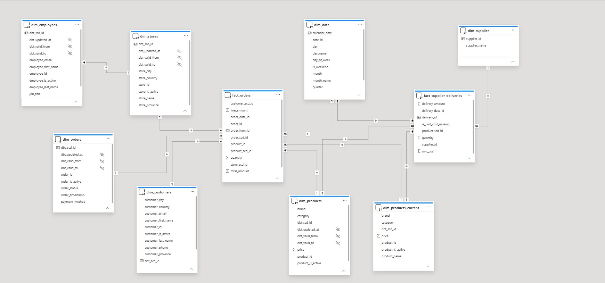

Galaxy schema: `fact_orders` (order line grain) and `fact_supplier_deliveries` (delivery grain), sharing `dim_date` and `dim_product`. `dim_employees` connects to `dim_stores`, not to either fact table.

### dbt lineage

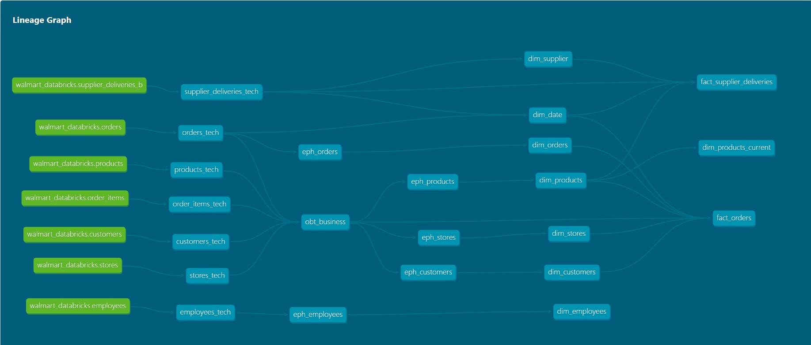

Full source-to-gold dependency graph from `dbt docs generate`.

### dbt test verification

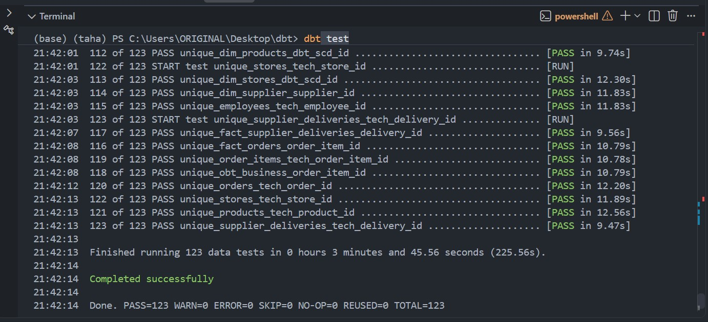

123/123 tests passing: generic FK tests across all dimension pairs, singular grain checks per fact table, CI quality gate tests.

### Airflow: sequential baseline

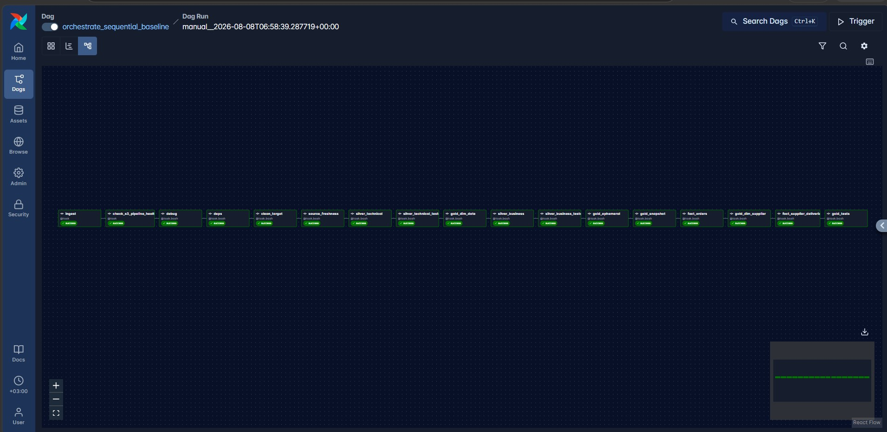

`orchestrate_sequential_baseline.py`. All tasks run in strict order with no parallelism. Used as the timing baseline.

### Airflow: parallel DAG

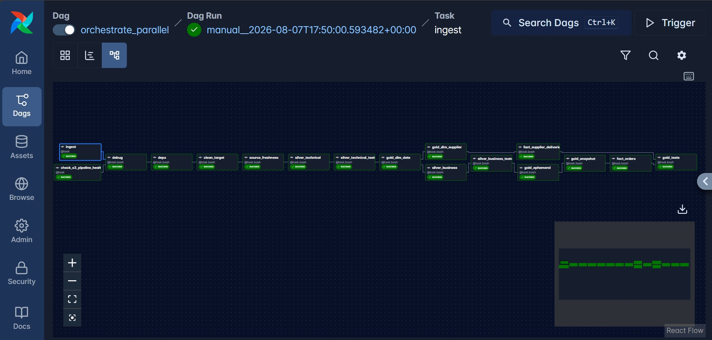

`orchestrate_parallel.py`. After `dim_date` is built the DAG forks into independent Sales and Supplies branches, then rejoins at `gold_tests()`. Three measured runs averaged 9:03 sequential versus 7:35 parallel, a consistent ~16% wall-clock reduction. Full data in [`airflow/README.md`](airflow/README.md).

### Failure alerting

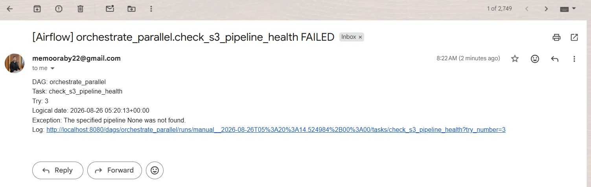
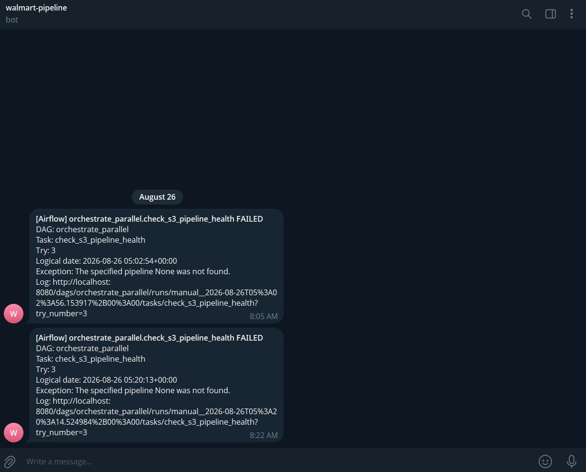

Task-level failure callbacks firing to Gmail and Telegram independently from the same DAG run.

### Genie Agent

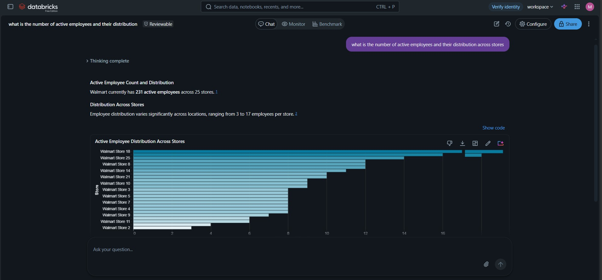

Natural language query answered directly against the gold layer. 231 active employees across 25 stores, returned with an auto-generated chart.

### Power BI report

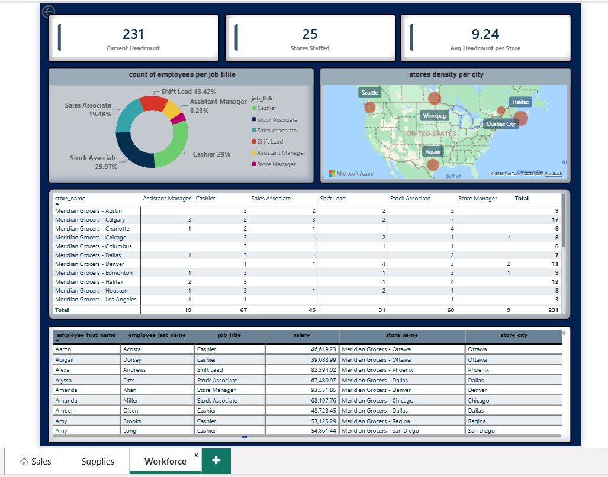

One of three report pages built on the gold layer. Full report at [retail-report.com].

### Secondary ingestion (S3)

.jpg)

Managed Lakeflow pipeline loading supplier delivery CSVs from S3 into `supplier_deliveries_b`.

### Source database running

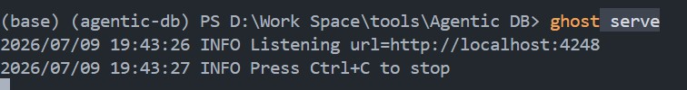

PostgreSQL instance on Ghost.build. Six-table OLTP source for the primary ingestion path.

### CI gate passing

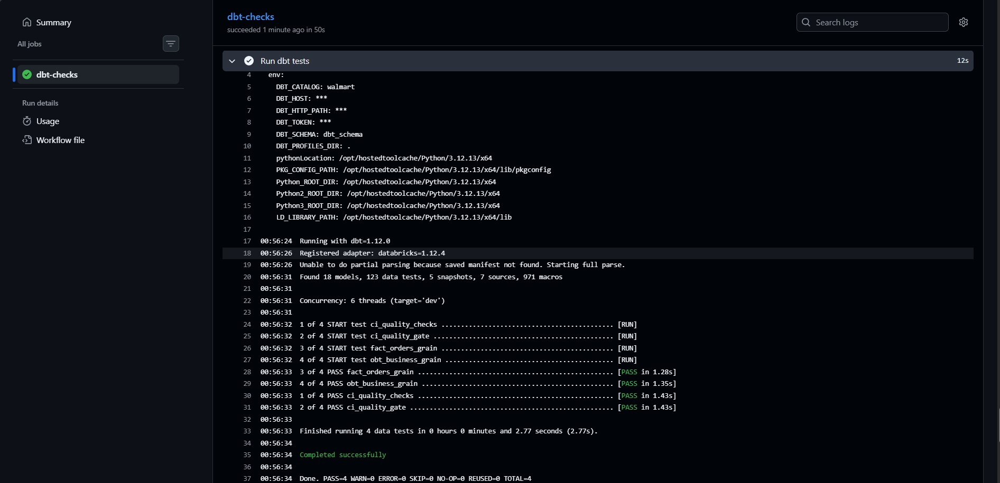

GitHub Actions runs the full dbt test suite on every push and blocks merge on failure. Workflow: [`.github/workflows/dbt-ci.yml`](.github/workflows/dbt-ci.yml).

---

## Ingestion pattern: not CDC

Bronze ingestion from PostgreSQL uses Lakeflow Connect's query-based connector: a cursor column plus primary key upsert per table, run on a schedule. This is not CDC.

True CDC requires a continuous classic-compute gateway to read PostgreSQL's write-ahead log. Databricks Free Edition is serverless-only and cannot provision that gateway. The tradeoff is explicit: each run captures the latest row state, not the full change history between runs. This constraint was accounted for in the SCD2 snapshot design from the start.

The S3 path uses a separate managed Lakeflow pipeline on its own Databricks-managed schedule, independent of Airflow. The DAG polls the Databricks Pipelines API to verify the pipeline completed before any downstream procurement work runs. Full detail in [`s3/README.md`](s3/README.md).

---

## Engineering decisions

### Metadata-driven silver business layer

**Decision:** dbt builds `obt_business` from a structured config (table ref, join key, column list) compiled into `SELECT` and `JOIN` clauses by a Jinja `for`-loop, not hand-written SQL.

**Why:** Adding a source table means one config entry, not a new SQL block to write and re-verify. The config uses `ref()`, not hardcoded paths, so `dbt docs generate` lineage survives the abstraction.

### Fan-out bug found and fixed via independent grain verification

**What happened:** `obt_business` produced 300,513 rows against an expected grain of 30,021. Every `dbt run` and every `dbt test` passed clean.

**Root cause:** `employees_tech` joined on `store_id`, which is not unique. A store has many employees, so the join cross-multiplied. The deeper cause: `orders` has no `employee_id`. The source system never recorded which employee handled which order.

**Fix:** The join was removed. `dim_employees` connects to `dim_stores` in gold, not to `fact_orders`.

**Standing practice:** Every new or changed join requires a `COUNT(*) vs COUNT(DISTINCT <primary_key>)` check before the model is closed. A passing `dbt run` confirms execution, not correctness.

### SCD2 floor-gap fallback join in `fact_orders`

**Problem:** A strict `BETWEEN dbt_valid_from AND dbt_valid_to` predicate silently null-fills surrogate keys for orders that predate the earliest tracked version of a dimension key. Snapshot observation time is not the same as entity creation time.

**Fix:** Precomputed per-key floor CTEs (`MIN(dbt_valid_from) GROUP BY <natural_key>`) with a fallback join branch that assigns the earliest known version to any order falling before it. Correlated scalar subqueries were rejected: Spark Catalyst does not support them in this context.

**Verified:** Zero nulls across all surrogate and natural key columns in `fact_orders` after fix.

### `dim_products_current` outrigger

**Decision:** A `dim_products_current` view, pre-filtered to one active row per product, serves as the join target for both fact tables and as the anchor for Power BI relationships.

**Why:** Power BI cannot build a valid relationship against a non-unique column. An SCD2 dimension has multiple rows per natural key by design. The outrigger carries both `dbt_scd_id` (for `fact_supplier_deliveries`, current-state resolution) and `product_id` (for `fact_orders`, point-in-time resolution via the floor-gap join). One pre-filtered view, two join paths, no duplication of SCD2 history.

### `dim_product`: shared but not fully conformed

**Decision:** Sales resolves `dim_product` point-in-time via SCD2. Supplies resolves to current record only.

**Why:** A supplier delivery is a procurement transaction, not a product history event. Applying point-in-time resolution to procurement would conflate two separate questions: what a product was at the time of a sale versus what the current acquisition cost is today.

### `dim_date`: dynamically generated range

**Decision:** `dim_date` is shared across both facts. Its range derives at build time from the min and max dates in the source tables, padded 30 days on each side.

**Why:** A hardcoded range silently stops covering new data with no error, only silent join misses. Deriving it from live source data means the dimension grows with the data automatically.

### Parallel DAG: Sales and Supplies run concurrently after `dim_date`

**Decision:** `orchestrate_parallel.py` forks into independent Sales and Supplies branches after `dim_date` is built. Both rejoin at `gold_tests()`.

**Why:** The two processes share `dim_date` as their only dependency. Running them sequentially enforces an ordering the data doesn't require. Three measured runs averaged a ~16% wall-clock reduction versus the sequential baseline. Full data and caveats in [`airflow/README.md`](airflow/README.md).

### Execution timeouts with orphaned run cancellation

**Decision:** `ingest()` and `check_s3_pipeline_health()` carry an `execution_timeout`. If either task exceeds the limit, a callback cancels the orphaned Databricks job run before Airflow marks the task failed.

**Why:** Without cancellation, a timed-out task leaves a Databricks job running and consuming resources while Airflow has already moved on. The task appears failed in Airflow while the job continues writing data in Databricks.

### Dual-channel failure alerting

**Decision:** `on_failure_callback` is set in `default_args` so every task inherits it. Alerts push to Gmail and Telegram independently. The callback does not raise on its own failures.

**Why:** A single alert channel is a single point of silence. Setting it in `default_args` means a new task added to the DAG gets alerting automatically. A misconfigured alert does not crash the DAG at import. The original task failure always propagates regardless of what the alert path does.

### Power BI Import mode over DirectQuery

**Decision:** The report connects via Databricks Partner Connect in Import mode, not DirectQuery.

**Why:** The gold layer is a batch pipeline. The data does not change between scheduled runs. DirectQuery adds round-trip latency to every visual interaction for no freshness benefit. Import mode loads once per refresh and keeps all calculations in memory. The tradeoff: report data is as fresh as the last scheduled refresh, not real-time.

### Two consumption paths instead of one

**Decision:** The gold layer serves both a fixed Power BI report and a Genie Agent for ad-hoc natural language queries.

**Why:** A fixed report answers the questions stakeholders ask every week efficiently. It cannot answer the question nobody has written a query for yet. A Genie Agent against the same verified gold tables covers that gap without a new report cycle for every one-off question. The two paths are not redundant: one handles known-shape recurring queries, the other handles everything else.

---

## Repo structure

```text
retail-lakehouse-pipeline/
├── README.md
├── BUSINESS_LAYER.md
├── .gitignore
├── .github/
│   └── workflows/
│       └── dbt-ci.yml
├── postgres/
│   ├── dataset/
│   ├── ddl/
│   └── README.md
├── s3/
│   ├── CSVs/
│   └── README.md
├── dbt/
│   ├── models/
│   │   ├── source/
│   │   ├── silver_tech/
│   │   ├── silver_business/
│   │   └── gold/
│   │       ├── ephemeral/
│   │       ├── dimension/
│   │       └── fact/
│   ├── macros/
│   ├── snapshots/
│   ├── tests/
│   │   ├── ci/
│   │   ├── grain/
│   │   └── singular/
│   ├── dbt_project.yml
│   ├── DECISION_LOG.md
│   └── README.md
├── airflow/
│   ├── dags/
│   │   ├── orchestrate_parallel.py
│   │   └── orchestrate_sequential_baseline.py
│   ├── docker-compose.yml
│   ├── Dockerfile
│   └── README.md
└── docs/
    ├── Project-Architecture.png
    ├── Data-model.jpg
    ├── dbt-data-lineage.jpg
    ├── dbt-test-verification.jpg
    ├── sequential-dag-run.jpg
    ├── parallel-dag-run.jpg
    ├── failure-to-gmail.jpg
    ├── failure-to-telegram.jpg
    ├── genie-agent.jpg
    ├── supplier-deliveries-(S3-buck).jpg
    ├── ghost-server-running.jpg
    ├── ci-test-passed.jpg
    └── Workforce.jpg
```

---

## Current build state

- PostgreSQL source provisioned: 6 tables loaded (customers, stores, products, employees, orders, order\_items).
- Primary bronze ingestion complete: Lakeflow Connect, query-based connector, cursor column plus primary key per table.
- Secondary bronze ingestion complete: managed Lakeflow pipeline, S3 supplier delivery CSVs, upsert into `supplier_deliveries_b`.
- Silver technical layer complete: 7 incremental models, one per source table.
- Silver business layer complete: `obt_business` metadata-driven, verified correct on grain after the fan-out fix.
- Gold layer complete: galaxy schema, two fact tables, shared conformed dimensions.
  - `fact_orders`: order line grain, zero null surrogate keys.
  - `fact_supplier_deliveries`: delivery grain.
  - SCD2 snapshots complete for all Sales-side dimensions. `dim_supplier` deliberately SCD1.
- 123/123 dbt tests passing: generic FK tests, singular grain checks, CI quality gate.
- Airflow orchestration complete: parallel DAG in Docker, dual-channel failure alerting (Gmail + Telegram), execution timeouts with orphaned run cancellation.
- GitHub Actions CI complete: blocks merge on dbt test failure.
- Power BI report complete: three pages (Sales, Supplies, Workforce), Import mode via Databricks Partner Connect.
- Genie Agent live: natural language querying against the full gold layer.
- Not yet built: dev/staging/prod environment parameterization.

---

## Known limitations

- **Soft and hard deletes are not tracked in bronze.** The query-based connector captures the latest row state per run. A deleted source row disappears silently. Wiring an `is_active` flag into the Lakeflow Connect ingestion requires Databricks Asset Bundles or a direct REST call. Deferred.
- **Lakeflow Connect captures latest state only per run.** Changes between two consecutive runs are not captured as individual events. Accounted for in the SCD2 snapshot design.
- **No employee-to-order relationship exists in the source data.** `orders` has no `employee_id` column. Employee reporting is answerable at the store level only.
- **No environment split.** One Databricks target, one connection. Dev, staging, and prod are not parameterized.
- **No automated PAT token rotation.** The Databricks Personal Access Token used by Airflow expires on a fixed schedule. Rotation requires manual intervention and has caused live DAG failures.
- **Power BI data freshness is bounded by the import refresh schedule.** The report reflects the gold layer state at the last refresh, not the current moment.

---

## What I would change with more time

- **Automate PAT token rotation.** Replace PAT-based auth with Databricks service principal OAuth M2M to eliminate manual rotation and the live failure risk it carries.
- **Add a dev/staging/prod environment split.** One target with one connection means pipeline changes and production data share the same namespace. Databricks Asset Bundles with environment-scoped targets would address this.
- **Persist `manifest.json` and `run_results.json` between Airflow runs.** Right now dbt run history is only visible in the Airflow UI at point-in-time. Persisting these artifacts enables historical trend analysis across runs.
