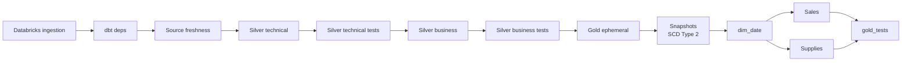

# Airflow orchestration


This directory contains the orchestration layer for the retail lakehouse pipeline.
Airflow doesn't ingest data and doesn't transform data. It sequences two systems that already do those jobs: a Databricks job for ingestion, and dbt for every transformation. The DAG's only job is ordering, dependency enforcement, and failure isolation.

---

## Pipeline flow



Each arrow is a hard dependency. If a stage fails, nothing downstream of it runs. No dbt task executes against partially ingested or partially tested data.

After `dim_date` is built, the DAG forks into two independent branches, Sales and Supplies, and both rejoin at a single task, `gold_tests()`, which runs the full test suite against both fact tables together before either is considered done. See [Sales and Supplies run as parallel branches after `dim_date`](#sales-and-Supplies-run-as-parallel-branches-after-dim_date) below for why.

---

## Proof

### Sequential vs parallel benchmark


`orchestrate_sequential_baseline.py`. Every task, including Sales and Supplies, runs in strict order with no fork.


`orchestrate_parallel.py`. The DAG forks after `dim_date` into independent Sales and Supplies branches, then rejoins at `gold_tests()`.

Four runs measured across both DAGs:

| Run | Sequential | Parallel | Wall-clock saved | Reduction |
|-----|-----------|----------|-----------------|-----------|
| 1   | 9:23      | 7:52     | 1:31            | 16.2%     |
| 2   | 8:57      | 7:31     | 1:26            | 16.0%     |
| 3   | 8:49      | 7:23     | 1:26            | 16.3%     |
| **Avg** | **9:03** | **7:35** | **1:28**   | **16.1%** |

Three runs, consistent within a 34-second band on each side. The ~16% wall-clock reduction holds as a repeatable result.

### Failure alerting


Task-level failure callbacks push to Gmail and Telegram independently. Both channels fire on any task failure. A failure in the alert path itself does not raise, so it cannot mask the original task failure.

---

## Project structure

```text
airflow/
├── dags/
│   ├── orchestrate_parallel.py              # Parallel: Sales/Supplies fork after dim_date
│   └── orchestrate_sequential_baseline.py   # Sequential: same pipeline, no fork, timing baseline
├── config/
├── plugins/
├── .env.example                             # Copy to .env and fill in credentials
├── Dockerfile
├── docker-compose.yml
├── requirements.txt
└── README.md
```

---

## Engineering decisions

### Airflow is an orchestrator, not a processing engine

**Decision:** The DAG contains no SQL and no transformation logic. It triggers the Databricks ingestion job, then runs dbt commands in a fixed sequence.

**Why:** A DAG task that runs raw SQL against the warehouse duplicates work dbt already owns, including lineage, dependency resolution, testing, and documentation, without any of that context. Keeping Airflow strictly declarative and dbt strictly transformational means a change to business logic happens in one place only.

### `run` and `test` run as separate tasks, not `dbt build`

**Decision:** Every layer runs as two sequential tasks: build, then test. `dbt build` was explicitly rejected.

**Why:** `dbt build` reports one pass/fail for a combined build-and-test operation. Splitting the tasks tells you immediately whether a model failed to build or built successfully but failed validation. Those are two different failure classes with two different fixes.

```text
Silver Technical
        │
        ▼
Silver Technical Tests
        │
        ▼
Silver Business
        │
        ▼
Silver Business Tests
```

### Sales and Supplies run as parallel branches after `dim_date`

**Decision:** Once `dim_date` is built, the DAG forks into two independent branches, Sales and Supplies, running concurrently. Both rejoin at `gold_tests()`, which runs the full test suite against both fact tables before either is considered done.

**Why:** Sales and Supplies depend on each other's shared conformed dimensions, not on each other's intermediate models. Running them sequentially enforces an ordering the data doesn't require. `orchestrate_sequential_baseline.py` exists to produce a real before/after comparison rather than assert the benefit without a number behind it. See [benchmark results](#sequential-vs-parallel-benchmark) above for the full data.

### Ingestion runs as a monitored Databricks job, not inline Airflow logic

**Decision:** Bronze ingestion runs through the Databricks SDK (`WorkspaceClient`) as an external job. Airflow polls the Jobs API until the run reaches a terminal state before any dbt task starts.

**Why:** Ingestion is compute-heavy and belongs on the compute engine, not inside a scheduler container. Polling for terminal state, instead of firing the job and assuming success, is what enforces the dependency. Without it, "ingestion runs before transformation" is a scheduling expectation, not a guarantee.

### Execution timeouts with orphaned run cancellation

**Decision:** `ingest()` and `check_s3_pipeline_health()` carry an `execution_timeout`. If either task exceeds the limit, a callback issues a Databricks API call to cancel the orphaned job run before Airflow marks the task as failed.

**Why:** Without cancellation, a timed-out task leaves a Databricks job running and consuming resources after Airflow has moved on. The task appears failed in Airflow while the job continues in Databricks, creating a split-brain state where a "failed" ingestion run has actually written data.

### Failure alerting on both Gmail and Telegram

**Decision:** `on_failure_callback` is set in `default_args`, so every task in the DAG inherits it automatically. Alerts push to Gmail via an Airflow SMTP Connection and to Telegram via Bot API (`telegram_bot_token`, `telegram_chat_id`). Both channels fire independently. Configuration resolves at execution time, not at module parse time. The callback does not raise on its own failures.

**Why:** A single alert channel is a single point of silence. Setting the callback in `default_args` rather than per-task means a new task added to the DAG gets alerting automatically with no per-task wiring. Resolving config at execution time means a misconfigured alert does not crash the DAG at import. The original task failure always propagates regardless of what the alert path does.

### Credentials live in an Airflow connection, not in code

**Decision:** Databricks credentials are stored as an Airflow connection and retrieved at runtime:

```python
conn = BaseHook.get_connection("databricks_default")
```

**Why:** Hardcoded credentials in a DAG file mean the DAG can't move between environments without editing code, and they end up in version control history whether or not anyone intends that. A connection object is environment-scoped. The same DAG code runs against dev or prod credentials depending on where it's deployed.

---

## Docker layout

The dbt project is mounted into the container as a volume, not copied into the image at build time.

```text
Host
├── airflow/
└── dbt/

        │
        ▼

Container
/opt/airflow
├── dags
├── plugins
└── dbt
```

A mounted volume means SQL, macro, and snapshot changes appear inside the container as soon as you save them, with no rebuild required. The image only needs a rebuild when Python dependencies change, which happens far less often than a model change during active development.

### dbt runs in its own virtual environment, isolated from Airflow's

```text
/opt/airflow/dbt_venv
```

Every dbt task calls `/opt/airflow/dbt_venv/bin/dbt` directly, never the Airflow container's default Python.

Airflow and dbt are both Python apps with independent, frequently conflicting dependency trees: provider packages against adapter packages. Installing dbt into Airflow's environment risks a dependency resolution failure the moment either project updates a pinned version. A dedicated venv resolves each tool's dependencies independently in the same container, without the two conflicting.

---

## Issues found and fixed

Each of these is a real failure from the build. Root cause and fix only.

1. **Docker volume mount overwrote the dbt virtual environment.**
   Cause: the venv was created inside the image at the same path where the project volume later got mounted, so the mount replaced it silently at container start.
   Symptom: `/opt/airflow/dbt_venv/bin/dbt: No such file or directory`, which reads like a failed install but is not.
   Fix: create the venv at a path outside the mounted project directory so the volume mount cannot overwrite it.

2. **`uv` tried to install into a venv that didn't contain `uv`.**
   Cause: `uv venv` creates a Python environment, not a copy of the `uv` binary inside it. Calling `dbt_venv/bin/uv` fails because that binary was never placed there.
   Fix: run `uv pip install --python /opt/airflow/dbt_venv/bin/python dbt-core dbt-databricks` from the environment that already has `uv` installed, targeting the venv's Python directly.

3. **A nested dbt project caused dbt to load the wrong `dbt_project.yml`.**
   Cause: two `dbt_project.yml` files existed at different directory levels in the repo. dbt resolved to the wrong one, producing `No nodes selected` and selector errors like `'silver_tech' does not match any enabled nodes`.
   Fix: flatten the repo to a single dbt root with exactly one active `dbt_project.yml`.

4. **Flattening the project broke package resolution.**
   Cause: after the restructure, the active project's `dbt_packages` directory was empty, producing `dbt found 1 package(s) specified in packages.yml, but only 0 package(s) installed`.
   Fix: run `dbt deps` after any structural change. The DAG now runs `dbt deps` as the first task on every execution so this failure class cannot recur silently.

5. **Host paths and container paths don't match.**
   Cause: the dbt project resolves to different absolute paths on the host machine versus inside the container (`dbt/` versus `/opt/airflow/dbt`).
   Fix: the DAG hardcodes container paths only. Orchestration logic never depends on the developer's local filesystem layout.

6. **Expired Databricks PAT caused live DAG failures.**
   Cause: the Databricks Personal Access Token stored in the Airflow connection has a fixed expiration date. Rotation is manual.
   Symptom: every DAG task that calls the Databricks SDK fails immediately with a 403 on the first API call.
   Fix: generate a new PAT in the Databricks workspace, update the Airflow connection, and redeploy. No automated rotation is in place. This is a live limitation, tracked in the root `README.md`.

---

## Known limitations

- **No environment split.** One Airflow connection, one Databricks target. Dev, staging, and prod are not parameterized.
- **No dbt state-based selective runs.** Every execution runs the full DAG regardless of what changed upstream.
- **No automated PAT token rotation.** The Databricks Personal Access Token expires on a fixed schedule. Rotation requires manual intervention. See issue 6 above.

---

## Future improvements

- Adopt dbt state comparison (`--select state:modified+`) to run only what changed upstream instead of the full DAG every time.
- Parameterize environments (dev, staging, production) through Airflow variables or per-environment connection configuration.
- Replace PAT-based Databricks auth with service principal OAuth M2M to eliminate manual token rotation.
