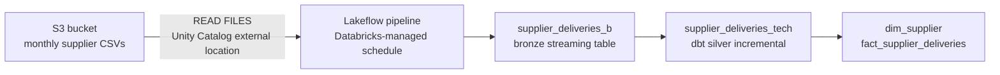

# S3 secondary ingestion

This directory covers the secondary ingestion path for the retail lakehouse pipeline: monthly supplier delivery CSVs from AWS S3 into the bronze layer.

---

## What this path is and is not

This ingestion path uses a Lakeflow file connector, configured through the Databricks Jobs and Pipelines UI, backed by a Unity Catalog external location. No PySpark code, no Auto Loader (`cloudFiles` format), and no custom merge logic were written for this layer.

The three components are distinct and each owns a different responsibility:

- **Unity Catalog external location**: the access layer. A storage credential registered in Unity Catalog maps to the S3 bucket and grants the Lakeflow pipeline `READ FILES` on that path. It is not an ingestion mechanism. It is the credential and governance construct that makes the bucket visible to the platform.
- **Lakeflow pipeline**: the ingestion mechanism. Configured through the Jobs and Pipelines UI, it reads CSV files from the external location path on a Databricks-managed schedule and merges new records into the bronze streaming table. The pipeline definition is platform-generated and platform-managed, no notebook or SQL was written to produce it.
- **`supplier_deliveries_b`**: the output. A streaming Delta table in the bronze layer, maintained by the pipeline. Each scheduled run picks up new files and merges them in.

---

## Architecture

Two separate merge operations at two separate layers: the Lakeflow pipeline merges new S3 files into the bronze streaming table. `supplier_deliveries_tech` is a separate incremental dbt model that reads from that bronze table with its own `unique_key` and merge strategy. Two distinct decisions, not one operation described twice.

---

## Why the pipeline runs outside Airflow, and how Airflow handles that

**Decision:** The S3 Lakeflow pipeline runs on its own Databricks-managed schedule, outside Airflow's control. A dedicated DAG task polls the Databricks Pipelines API and checks the latest pipeline update state before the entire downstream procurement chain, `supplier_deliveries_tech` through `dim_supplier` and `fact_supplier_deliveries`, is allowed to run. The task raises if the pipeline's latest update is not in a completed, current state.

**Why:** A pipeline that runs outside your orchestrator is a scheduling assumption. You cannot set an Airflow dependency on a Databricks-managed trigger. Without an explicit check, the DAG proceeds against whatever bronze data happens to be there, complete or stale. Gating the full procurement chain, not just the first silver model, means a failed or still-running S3 pipeline cannot produce a `fact_supplier_deliveries` that appears complete but is built on partial data.

This is the same principle as the primary ingestion path in [`airflow/README.md`](../airflow/README.md): don't assume a source landed because it's scheduled to. Verify terminal state before downstream work depends on it.

---

## Why not write custom ingestion code here

**Decision:** The managed Lakeflow pipeline UI path was the right scope call for this project.

**Why this project exists** (from the root [`README.md`](../README.md)): the skill gaps this project was built to close are dbt and Docker. Ingestion mechanics are not one of them. Writing a PySpark streaming job or hand-rolling a `COPY INTO` pipeline to prove a point would have consumed time without closing a gap. The platform-managed path handles file detection and the bronze merge internally. Using it here was deliberate, not a shortcut.

The tradeoff is explicit: the managed pipeline offers less visibility into per-file processing state and no custom error handling at the file level. For a monthly batch of CSVs at this volume, that tradeoff is acceptable. A production system with higher volume, tighter SLAs, or schema variability would warrant a different approach.

---

## Proof

.jpg)

Lakeflow pipeline connected to the S3 external location, loading supplier delivery CSVs into `supplier_deliveries_b`.
